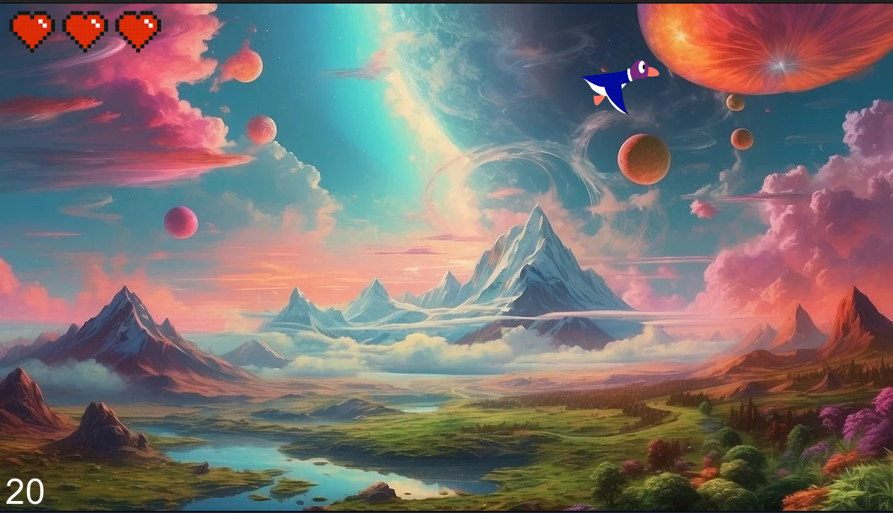

# MyHunter

## 🗺️ Project Overview

**MyHunter** is a **CSFML**-based, first graphical project developed as part of the first-year module in graphical programming. The game is a **shooter game** featuring animated sprites, a scoring system, and a life system. The goal of the game is to shoot ducks and accumulate points while managing the player's lives.

Key features of the game:
- **Animated Sprites**: The player and the targets are represented by animated sprites.
- **Scoring System**: Points are earned by shooting targets.
- **Life System**: The player has a limited number of lives; losing all lives results in the game ending.
- **Game Mechanics**: The player can move, shoot, and interact with the game environment.

---

## 🚀 How to Use

### Compilation

To compile the project, simply run the following command using the provided **Makefile**.

### Running the Game

Once compiled, run the program to start the game.

Try to shoot the targets and avoid obstacles while keeping an eye on your score and remaining lives.

---

## 🖼️ Example Screenshot

Here is an example output showing the game in action:

---

## ✨ Features

- **Animated Sprites**: The player and targets have smooth animations.
- **Scoring System**: Points are accumulated by shooting targets.
- **Life System**: The player loses lives when hitting obstacles or missing too many shots.
- **CSFML Graphics**: Built with CSFML to handle graphics, window events, and input.
  
---

## 📌 Project Status

✅ Completed  
🏆 Received Grade A in the graphical programming module.

---
